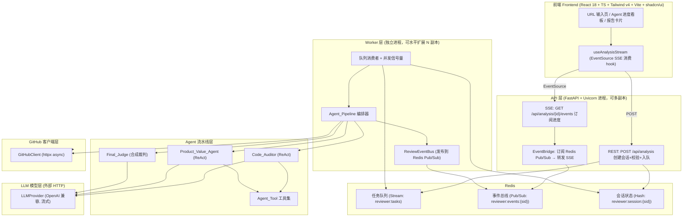
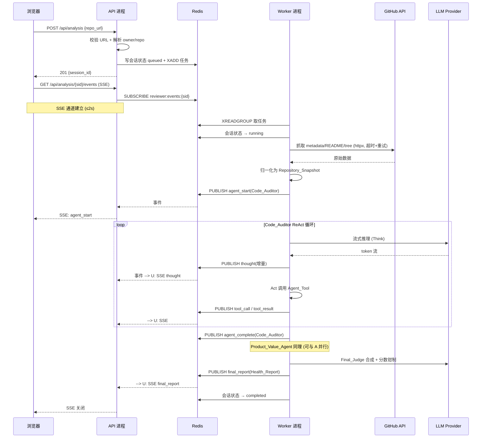
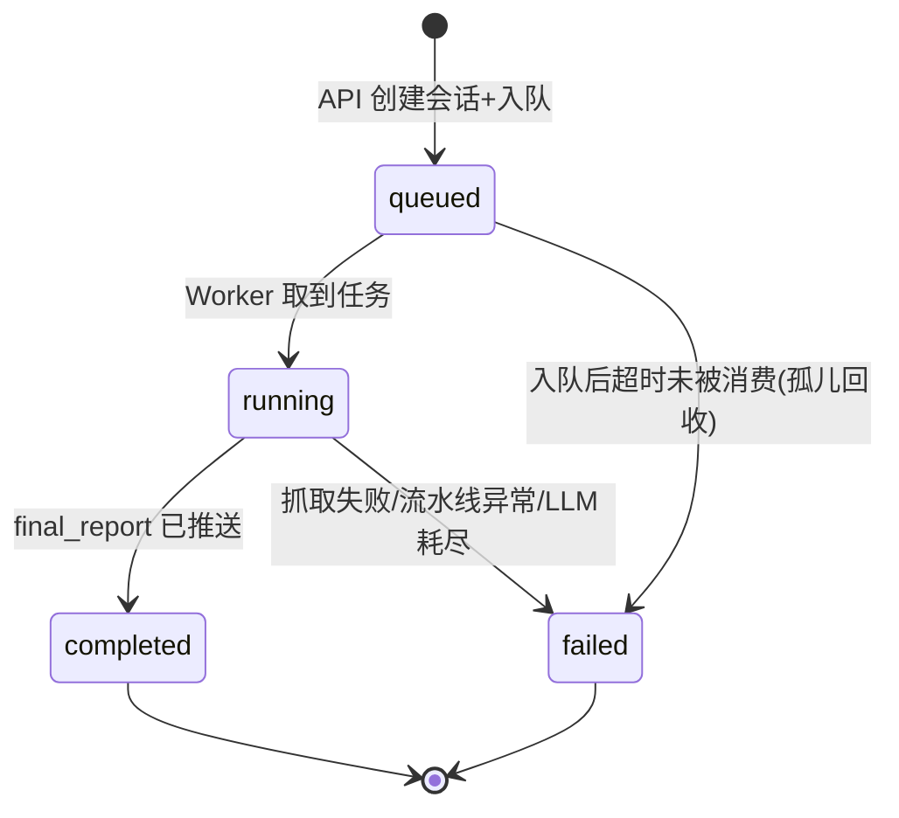
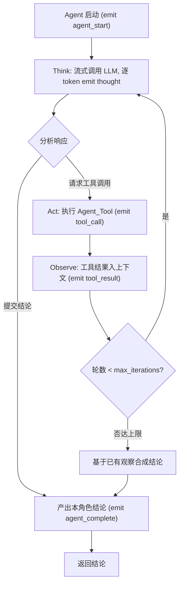

# 设计文档

## Overview

（概述）


Reviewer 是一个多 Agent 协作的 GitHub 仓库"评估"工具。用户在 Web 界面提交一个公开 GitHub 仓库 URL，后端抓取仓库元数据 / README / 代码结构，交由一条具备 ReAct（Think → Act → Observe + 工具调用）特征的多 Agent 流水线（Code_Auditor 代码审计、Product_Value_Agent 产品价值、Final_Judge 总分裁判）协作分析，最终产出一份 0–100 分的结构化健康评估报告；全过程通过 SSE 实时流式推送到前端。

系统作为工作区根目录下的独立项目 `reviewer` 存放，工程结构与视觉风格沿用 artoo（后端 FastAPI + Uvicorn，ReAct 引擎 + EventBus 流式；前端 React 18 + TypeScript + Tailwind CSS v4 + Vite），并参考 WeKnora、SAG 的分层解耦。

### 设计目标

1. **多 Agent ReAct 为核心**：每个 Agent 自主推理、按需调用工具、观察结果并迭代，而非固定线性处理（需求 4）。
2. **全程可视、实时流式**：思考、工具调用、阶段结论、最终报告通过 SSE 逐段推送，前端逐 token 渲染（需求 5、6）。
3. **健壮并发**：多个评估任务并行时不发生线程崩溃 / 资源争用。采用 **Redis 队列 + 独立可水平扩展 Worker** 将 API 层与执行层解耦；执行侧全程 `asyncio + httpx` 有界并发，单任务失败隔离（需求 4、7，跨进程并发设计）。
4. **数据往返一致**：Repository_Snapshot 与 Health_Report 的序列化/解析满足往返属性，保证跨进程传递与调试时不失真（需求 3、6）。
5. **模型可替换、后端轻量**：所有 LLM 推理通过 HTTP 调用 OpenAI 兼容服务，超时 + 指数退避 + 瞬态/非瞬态错误分流（需求 7）。
6. **清晰分层与可运行**：前后端分离，后端按 API 层 / Agent 流水线层 / GitHub 客户端层 / 模型调用层隔离，附本地运行说明与环境变量清单（需求 9）。

### 关键设计决策与理由

| 决策 | 理由 |
| --- | --- |
| 任务入 Redis 队列 + 独立 Worker 执行，而非在 API 请求内直接跑流水线 | 一次评估耗时数十秒且含多轮 LLM/GitHub I/O，若在 API 进程内执行会长时间占用请求协程、堆积连接，多任务并发时拖垮 API。解耦后 API 只做"建会话 + 入队 + SSE 订阅"，Worker 专注执行，可独立水平扩展（沿用 artoo 的 Redis Stream + Worker 模式） |
| 跨进程 EventBus 用 Redis Pub/Sub 桥接 | SSE 连接活在 API 进程，流水线跑在 Worker 进程，进程内 EventBus 无法直达。Worker 把 Progress_Event 发布到 `reviewer:events:{session_id}` 频道，API 进程订阅后转发到 SSE 通道 |
| 执行侧统一 `asyncio + httpx.AsyncClient`，不使用线程池跑 LLM/GitHub 调用 | 评估负载是 I/O 密集（等 LLM、等 GitHub），协程在等待时让出事件循环，单线程即可承载大量在途请求；线程池模型下每任务占一线程，任务数一多线程栈内存耗尽 / 上下文切换开销激增，才是"线程崩溃"的根因。CPU/阻塞型操作（如 JSON 大对象解析）用 `asyncio.to_thread` 隔离到有限线程池 |
| 单 Worker 内用信号量限制并发评估数 | 避免单进程无限接单打爆下游（LLM/GitHub）连接与内存；并发度可配置，配合多 Worker 水平扩展 |
| Snapshot / Report 用 Pydantic v2 建模 | 天然提供 JSON 序列化/解析、缺字段/类型不匹配的结构化校验错误，直接满足需求 3、6 的解析错误要求 |

---

## 与需求的映射

| 需求 | 覆盖设计小节 |
| --- | --- |
| 需求 1 URL 输入与校验 | 前端设计（URL 输入与校验）、API 层（`POST /api/analysis` 校验与 URL 解析） |
| 需求 2 GitHub 数据抓取 | GitHub 客户端设计（元数据/README/目录树、速率限制、超时重试、降级、归一化 Snapshot） |
| 需求 3 Snapshot 序列化/解析往返 | 核心数据模型（Repository_Snapshot + 序列化器/解析器）、正确性属性 1、测试策略 |
| 需求 4 多 Agent ReAct 流水线 | 多 Agent ReAct 流水线设计（ReAct 循环、Agent 基类、三角色、工具集、最大轮数兜底、分数钳制） |
| 需求 5 实时流式推送 | EventBus / SSE 跨进程流式推送设计（事件类型、心跳、关闭、跨进程桥接） |
| 需求 6 结构化健康报告 | 核心数据模型（Health_Report + 序列化器/解析器）、前端报告卡片、正确性属性 2/3 |
| 需求 7 外部 LLM 调用 | LLM Provider 客户端设计（超时、流式、指数退避、瞬态/非瞬态分流、启动校验） |
| 需求 8 前端交互与视觉 | 前端设计（组件结构、状态管理、SSE hook、Agent 看板、动画方案、断线重连） |
| 需求 9 工程结构与运行说明 | 目录结构、后端并发与队列设计、README 与环境变量 |
| 需求 10 前后端测试 | 测试策略（URL 单测、Snapshot/Report 往返 PBT、Pipeline 编排 mock 测试、分数钳制边界、前端校验与 SSE 渲染测试） |

---

## Architecture

（系统架构）


### 分层架构图



**职责边界**：

- **API 进程**：只负责 (1) 接收并校验 URL、解析 owner/repo；(2) 创建 Analysis_Session 状态并写入 Redis；(3) 把任务入队；(4) 为 SSE 连接订阅该 session 的 Redis Pub/Sub 频道并把事件转发给浏览器。**API 进程不执行任何 GitHub 抓取或 Agent 推理**，因此单个评估不会阻塞 API。
- **Worker 进程**：从队列取任务，执行 GitHub 抓取 + 多 Agent 流水线，把每个 Progress_Event 发布到 Redis Pub/Sub，并更新会话状态机。Worker 无状态、可启动多副本水平扩展。

### 端到端时序图（含跨进程 SSE 事件桥接）



---

## 目录结构

系统位于工作区根目录下独立的 `reviewer/` 目录，前后端分离：

```
reviewer/
├── README.md                      # 前后端运行步骤 + 环境变量清单（需求 9.3）
├── .env.example                   # 环境变量样例
├── backend/
│   ├── requirements.txt
│   ├── .env.example
│   └── app/
│       ├── main.py                # FastAPI 入口（API 进程）
│       ├── worker_main.py         # Worker 进程入口
│       ├── config.py              # 配置（启动期 fail-fast 校验，需求 7.3/9.4）
│       ├── logging_config.py
│       ├── api/                   # 【API 层】——与执行层隔离
│       │   ├── analysis.py        #   POST /api/analysis, GET /events(SSE)
│       │   ├── schemas.py         #   请求/响应 Pydantic 模型
│       │   └── deps.py
│       ├── queue/                 # 【队列层】
│       │   ├── task_queue.py      #   Redis Stream 入队/消费封装
│       │   └── session_store.py   #   Analysis_Session 状态机 (Redis Hash)
│       ├── events/                # 【事件桥接层】
│       │   ├── event_bus.py       #   ReviewEventBus (发布到 Redis Pub/Sub)
│       │   ├── bridge.py          #   API 侧：订阅 Pub/Sub → SSE
│       │   └── types.py           #   ProgressEvent / EventType 定义
│       ├── worker/                # 【Worker 执行层】
│       │   ├── consumer.py        #   队列消费 + 并发信号量 + 失败隔离
│       │   └── runner.py          #   单任务执行编排（抓取 → 流水线）
│       ├── agent/                 # 【Agent 流水线层】——核心
│       │   ├── pipeline.py        #   Agent_Pipeline 编排器
│       │   ├── base.py            #   BaseReActAgent（ReAct 循环骨架）
│       │   ├── code_auditor.py    #   Code_Auditor
│       │   ├── product_value.py   #   Product_Value_Agent
│       │   ├── final_judge.py     #   Final_Judge（含分数钳制）
│       │   ├── tools/             #   Agent_Tool 工具集
│       │   │   ├── base.py
│       │   │   ├── read_tree.py
│       │   │   ├── read_file.py
│       │   │   ├── read_readme.py
│       │   │   └── read_metadata.py
│       │   └── prompts/           #   各角色系统提示词
│       ├── github/                # 【GitHub 客户端层】
│       │   └── client.py          #   GitHubClient（抓取/限流/重试/降级/归一化）
│       ├── llm/                   # 【模型调用层】
│       │   └── provider.py        #   LLMProvider（OpenAI 兼容/流式/退避）
│       └── models/                # 【数据模型层】
│           ├── snapshot.py        #   Repository_Snapshot / Metadata（序列化/解析）
│           └── report.py          #   Health_Report（序列化/解析）
│   └── tests/                     # pytest + hypothesis
│       ├── test_url_parse.py
│       ├── test_snapshot_roundtrip.py
│       ├── test_report_roundtrip.py
│       ├── test_pipeline_orchestration.py
│       └── test_final_judge_clamp.py
└── frontend/                      # React 18 + TS + Vite + Tailwind v4 + shadcn/ui
    ├── package.json
    ├── vite.config.ts
    ├── tailwind.config.js
    ├── index.html
    └── src/
        ├── main.tsx
        ├── App.tsx
        ├── pages/
        │   └── Review.tsx          # 主页面
        ├── components/
        │   ├── ui/                 # shadcn/ui 组件（button/input/card/progress...）
        │   ├── RepoUrlForm.tsx     # URL 输入 + 校验
        │   ├── AgentBoard.tsx      # Agent 进度看板
        │   ├── AgentCard.tsx       # 单 Agent 卡片（状态 + 思考流）
        │   ├── ThoughtStream.tsx   # 逐 token 思考渲染
        │   ├── ToolCallItem.tsx    # 工具调用/结果摘要
        │   └── HealthReport.tsx    # 报告卡片（五部分 + 分数环）
        ├── hooks/
        │   └── useAnalysisStream.ts # SSE 消费 hook（含重连）
        ├── lib/
        │   ├── api.ts
        │   ├── urlValidation.ts     # 前端 URL 校验（可单测）
        │   └── sseParser.ts
        └── types/
            └── events.ts            # ProgressEvent / HealthReport TS 类型
```

后端 4 个隔离模块对应需求 9.2：`api/`（API 层）、`agent/`（Agent 流水线层）、`github/`（GitHub 客户端层）、`llm/`（模型调用层），另加 `queue/`、`events/`、`worker/` 支撑并发解耦。

---

## Data Models

（核心数据模型）


所有数据模型使用 **Pydantic v2** 建模，天然支持 `model_dump_json()`（序列化）与 `model_validate_json()`（解析），并在缺字段/类型不匹配时抛出结构化的 `ValidationError`，用于满足需求 3、6 的解析错误描述要求。

### Repository_Metadata

```python
class RepositoryMetadata(BaseModel):
    owner: str
    repo: str
    stars: int                          # Star 数（整数）
    forks: int                          # Fork 数（整数）
    open_issues: int                    # Open Issue 数
    languages: dict[str, int]           # 语言 -> 所占字节数
    last_commit_at: str                 # ISO 8601 UTC 时间戳
    default_branch: str
```

### Repository_Snapshot

```python
class TreeEntry(BaseModel):
    path: str                           # 文件/目录路径
    type: Literal["file", "dir"]
    depth: int                          # 目录层级

class RepositorySnapshot(BaseModel):
    metadata: RepositoryMetadata
    readme: str                         # README 文本；无 README 时为 ""（需求 2.9）
    tree: list[TreeEntry]               # 目录结构（深度≤10, 条目≤10000）
    tree_truncated: bool = False        # 超上限时标记已截断（需求 2.3）
    representative_files: dict[str, str] # 路径 -> 代表性文件内容
    fetched_at: str                     # 抓取时间 ISO 8601 UTC
```

**序列化 / 解析（需求 3）**：

- `serialize_snapshot(snapshot) -> str`：调用 `model_dump_json()` 产出 UTF-8 JSON 文本，包含全部字段（≤5s，需求 3.1）。
- `parse_snapshot(text) -> RepositorySnapshot`：先 `json.loads` 探测语法（语法非法 → 抛 `SnapshotParseError` 带原因，需求 3.3），再 `model_validate_json`（缺字段/类型不匹配 → 抛带字段名与原因的错误，需求 3.4）。
- 往返一致（需求 3.5）：`parse_snapshot(serialize_snapshot(x)) == x` 对所有合法 Snapshot 成立。Pydantic 模型的 `__eq__` 按字段值比较，满足"字段存在性、类型、取值均相等"。

### Health_Report

```python
class MetadataSummary(BaseModel):
    stars: int
    forks: int
    language_distribution: list[LanguagePercent]  # [{name, percent}], 占比之和=100%

class CodeAuditorOpinion(BaseModel):
    strengths: list[str]                # ≥1（需求 4.9）
    improvements: list[str]             # ≥1（需求 4.9）
    summary: str

class ProductValueOpinion(BaseModel):
    readme_clarity: list[str]           # ≥1（需求 4.10）
    practical_value: list[str]          # ≥1
    activeness: list[str]               # ≥1
    summary: str

class HealthReport(BaseModel):
    metadata_summary: MetadataSummary       # 部分 1
    code_auditor: CodeAuditorOpinion         # 部分 2
    product_value: ProductValueOpinion       # 部分 3
    recommendations: list[str]               # 部分 4：3–10 条综合建议（需求 4.12）
    score: int = Field(ge=0, le=100)         # 部分 5：0–100 整数总分（需求 6.2）
```

**序列化 / 解析（需求 6.7–6.9）**：与 Snapshot 同构，`serialize_report` / `parse_report`；解析不符合结构的 JSON → 描述性错误（需求 6.8）；往返一致（需求 6.9）。`score` 字段用 `Field(ge=0, le=100)` 强约束，写入前经 Final_Judge 钳制层保证落在范围内（需求 6.3）。

### Analysis_Session 状态机

会话状态存于 Redis Hash `reviewer:session:{session_id}`，状态流转：



```python
class SessionStatus(str, Enum):
    QUEUED = "queued"
    RUNNING = "running"
    COMPLETED = "completed"
    FAILED = "failed"

class AnalysisSession(BaseModel):
    session_id: str
    repo_url: str
    owner: str
    repo: str
    status: SessionStatus
    created_at: str
    updated_at: str
    error: str | None = None
```

- **幂等/去重**：入队 key 采用 `owner/repo` 归一化后的哈希；若同一 `(owner, repo)` 已有处于 `queued`/`running` 的会话，API 复用其 session_id（或按配置拒绝重复），避免重复评估（需求 1.6 前端禁用提交 + 后端去重双保险）。
- **超时/孤儿回收**：Worker 消费用 Redis Stream Consumer Group，崩溃遗留在 PEL（Pending Entries List）的消息由周期性 `XAUTOCLAIM` 回收；超过 `SESSION_TASK_TIMEOUT` 仍未完成的 running 会话置 `failed` 并发 error 事件。

---

## Components and Interfaces

（组件与接口）


本节及其后的「EventBus / SSE 跨进程流式推送」「后端并发与队列」「GitHub 客户端」「LLM Provider 客户端」「前端设计」共同构成系统各组件与接口的详细设计。

### 多 Agent ReAct 流水线设计（核心）

这是系统的核心。流水线在 Worker 进程内执行，编排三个角色 Agent，每个 Agent 运行独立的 ReAct 循环。

### 单 Agent 的 ReAct 循环



循环规则（对应需求 4）：

- 每轮先产生推理文本（Think），再决定调用工具（Act）或提交结论（需求 4.2）。
- 工具结果纳入下一轮上下文（Observe，需求 4.3）。
- 轮数上限默认 8，可配置 1–20（需求 4.7）；达上限仍未提交结论则基于已获观察**合成兜底结论**并终止（需求 4.8），保证流水线不悬挂。
- 每个 Agent 的启动、每次工具调用、每次工具结果、每次结论提交都通过 EventBus 发射对应事件（需求 4.14）。

### Agent 基类与三角色

```python
class BaseReActAgent(ABC):
    role: str                          # "Code_Auditor" / ...
    def __init__(self, llm: LLMProvider, tools: ToolRegistry,
                 event_bus: ReviewEventBus, max_iterations: int = 8): ...

    @abstractmethod
    def system_prompt(self, snapshot_ctx: str) -> str: ...

    @abstractmethod
    def synthesize_fallback(self, observations: list[Observation]) -> AgentConclusion:
        """达最大轮数时的兜底合成（需求 4.8）"""

    async def run(self, context: PipelineContext) -> AgentConclusion:
        """执行 ReAct 循环，返回本角色结论"""
```

| Agent | 职责 | 结论约束 |
| --- | --- | --- |
| **Code_Auditor** | 评估目录结构与核心代码质量，给技术意见 | ≥1 优点 + ≥1 改进点（需求 4.9） |
| **Product_Value_Agent** | 评估 README 清晰度、实用价值、开源活跃度 | 三维度各 ≥1 条评估结论（需求 4.10） |
| **Final_Judge** | 汇总 A、B 结论生成总分与综合建议 | 0–100 整数总分 + 3–10 条建议（需求 4.12） |

**编排顺序**：Code_Auditor 与 Product_Value_Agent 相互独立，可 `asyncio.gather` 并行执行；两者结论就绪后作为输入传给 Final_Judge（需求 4.11）。Final_Judge 是"合成裁判"，本身可用轻量 ReAct 或单轮合成，重点在分数钳制与建议聚合。

### Agent_Tool 工具集

所有工具是纯函数式读取器，操作对象是内存中的 `Repository_Snapshot`（不再触碰网络），保证工具调用快速、确定、可测：

| 工具 | 输入 | 行为 |
| --- | --- | --- |
| `read_tree` | （无/前缀） | 返回目录结构 |
| `read_file` | `path` | 返回文件内容；命中则返回文本，单次上限 100000 字符，超出截断并标记（需求 4.5、4.15）；文件不存在返回"文件不存在"结果且循环继续（需求 4.6） |
| `read_readme` | （无） | 返回 README 文本 |
| `read_metadata` | （无） | 返回 Repository_Metadata |

```python
class ToolResult(BaseModel):
    success: bool
    output: str
    truncated: bool = False
    error: str | None = None
```

**错误容错（需求 4.16）**：Agent 请求的工具名不在注册表、或参数非法时，工具层返回带错误原因的 `ToolResult(success=False, ...)`，ReAct 循环不中断、继续下一轮。

### Final_Judge 分数钳制

分数钳制是独立、可单测的纯函数，作用在 Final_Judge 输出与写入 Health_Report 之间（需求 4.13、6.3）：

```python
def clamp_score(raw: float | int | None) -> int:
    if raw is None:
        return 0                        # 缺失 → 修正为 0
    try:
        v = int(round(float(raw)))       # 非整数 → 取整
    except (TypeError, ValueError):
        return 0
    return max(0, min(100, v))            # 越界 → 钳制到 [0,100]
```

边界：`-1 → 0`、`0 → 0`、`50 → 50`、`100 → 100`、`101 → 100`（需求 10.5 测试覆盖）。

### 系统提示词策略

- **Code_Auditor**：注入目录结构摘要与工具清单，指令其"先看结构再抽样读关键文件（如入口、配置、测试），输出至少 1 优点 1 改进点"，强制以结构化 JSON 提交结论。
- **Product_Value_Agent**：注入 README 与元数据，指令其从"README 清晰度 / 实用价值 / 活跃度"三维度各给至少一条结论。
- **Final_Judge**：注入 A、B 的结论，指令其打 0–100 整数分并给 3–10 条建议，要求分数与优缺点一致。提示词末尾追加"严格输出 JSON"纪律；即便模型越界或格式异常，也由 `clamp_score` 与解析兜底保证 Health_Report 合法（防御式，不依赖模型自觉）。

---

## EventBus / SSE 跨进程流式推送设计

### 事件类型与 payload schema

沿用需求 5 的 Progress_Event 类型集合：

```python
class EventType(str, Enum):
    AGENT_START = "agent_start"
    THOUGHT = "thought"
    TOOL_CALL = "tool_call"
    TOOL_RESULT = "tool_result"
    AGENT_COMPLETE = "agent_complete"
    FINAL_REPORT = "final_report"
    ERROR = "error"
    HEARTBEAT = "heartbeat"          # 保活（需求 5.9）

class ProgressEvent(BaseModel):
    type: EventType
    session_id: str
    agent: str | None = None         # 归属 Agent 角色
    seq: int                          # 单调递增序号，保证前端按序渲染
    data: dict                        # 类型相关载荷
    ts: float
```

各类型 `data` 载荷：

- `thought`：`{content: str, iteration: int}`（增量片段）
- `tool_call`：`{tool: str, args: dict}`
- `tool_result`：`{tool: str, summary: str, truncated: bool}`（摘要 >500 字符前端截断，需求 5.5）
- `agent_start` / `agent_complete`：`{agent, conclusion?}`
- `final_report`：完整 `HealthReport` JSON（需求 5.6）
- `error`：`{message: str, stage: str}`（需求 5.7）

### 跨进程桥接机制

因为 SSE 连接在 API 进程、执行在 Worker 进程，需要跨进程事件桥接：

```mermaid
flowchart LR
    subgraph Worker
        AG["Agent 流水线"] --> EB["ReviewEventBus.emit()"]
        EB -->|PUBLISH reviewer:events:{sid}| RP
    end
    subgraph Redis
        RP[("Pub/Sub 频道")]
    end
    subgraph API
        BR["EventBridge: SUBSCRIBE reviewer:events:{sid}"] --> SSEG["SSE Generator (yield)"]
        SSEG -->|text/event-stream| BROWSER["浏览器 EventSource"]
    end
    RP --> BR
```

1. **Worker 侧发射**：`ReviewEventBus.emit(event)` 将事件 `model_dump_json()` 后 `PUBLISH` 到 `reviewer:events:{session_id}` 频道。与 artoo 进程内 EventBus 接口一致，业务代码无感知跨进程。
2. **API 侧转发**：`GET /api/analysis/{sid}/events` 建立 SSE 后，`EventBridge` 用 `redis.pubsub()` 订阅该频道，收到消息即以 SSE 帧 `event: {type}\ndata: {json}\n\n` `yield` 给浏览器。
3. **建流时限**：会话开始后 API 在 2 秒内建立 SSE 流（需求 5.1）；事件按发射顺序、1 秒内推送（需求 5.2，`seq` 保序）。

### 心跳、关闭与断线重连

- **心跳保活**：SSE generator 用 `asyncio.wait_for(queue.get(), timeout=15)`，15 秒无事件则发一条 `heartbeat` 帧（需求 5.9）。
- **关闭**：收到 `final_report` 或 `error` 后，API 关闭 SSE 流并停止推送任何后续事件（需求 5.8、6/7）。
- **断线重连**：前端 `useAnalysisStream` 在 10 秒无数据判定中断（需求 8.5），自动重连最多 3 次、间隔 3 秒（需求 8.6）；重连时带 `Last-Event-ID`（对应 `seq`），API 侧对已完成会话直接补发终态。3 次失败保留中断提示与"重新发起分析"入口。

---

## 后端并发与队列设计（重点）

目标：多个 review 任务并行执行时不发生线程崩溃 / 资源争用，且可水平扩展。

### 为什么用 async 而非线程池

评估负载几乎全是 I/O 等待（等 GitHub 响应、等 LLM 流式 token）。

- **线程池模型的问题**：每个评估任务占一个线程，任务在等待 I/O 时线程被阻塞挂起。并发任务数一多，线程数线性增长——每线程默认 ~8MB 栈，几百个并发就吃掉数 GB 内存，加上 GIL 下大量上下文切换，最终触发 `RuntimeError: can't start new thread` / OOM，即"线程崩溃"。
- **asyncio 模型**：单线程事件循环 + 协程。任务等待 I/O 时 `await` 让出事件循环，一个线程可承载成百上千在途请求，内存与切换开销极低。GitHub 与 LLM 调用统一走 `httpx.AsyncClient`（连接池复用 + 超时），天然协作式并发。
- **CPU / 阻塞操作的隔离**：确有阻塞/CPU 型工作（如超大 Snapshot JSON 解析）时，用 `asyncio.to_thread` 派发到**有上限**的线程池（`ThreadPoolExecutor(max_workers=N)`），既不阻塞事件循环，又不会无限扩张线程数。

### 队列 + Worker 解耦

- **队列**：Redis Stream `reviewer:tasks` + Consumer Group `reviewer-workers`。API `XADD` 入队，Worker `XREADGROUP` 消费、成功后 `XACK`。Stream 的持久化 + PEL 机制支持崩溃恢复与孤儿回收（对比纯 list 更适合"至少一次 + 可回收"语义）。
- **API/Worker 职责边界**（重申需求映射）：API 只入队与 SSE 订阅；Worker 执行抓取 + 流水线。二者仅通过 Redis（队列 + Pub/Sub + 状态 Hash）交互，无共享内存，可各自独立扩缩容。

### 并发控制

```python
class ReviewConsumer:
    def __init__(self, max_concurrent: int = 4):
        self._sem = asyncio.Semaphore(max_concurrent)   # 单 Worker 最大并发评估数

    async def _handle(self, task):
        async with self._sem:
            try:
                await run_analysis(task)                 # 单任务失败隔离
            except Exception as e:
                await self._fail_session(task, e)        # 不影响其它任务
```

- **单 Worker 并发度可配**：`REVIEW_MAX_CONCURRENT` 信号量限制单进程同时执行的评估数，避免打爆下游连接/内存。
- **水平扩展**：同一 Consumer Group 下启动多个 Worker 副本，Redis 自动分配消息，无需改代码。
- **失败隔离**：每个任务在独立 `try/except` 中运行，异常仅让该 session 置 `failed` 并发 error 事件，绝不波及同进程其它任务（需求 5.7）。
- **有界外部并发**：`httpx.AsyncClient(limits=Limits(max_connections=...))` 限制 LLM/GitHub 连接总数；LLM 与 GitHub 请求均带超时（LLM 60s，GitHub 15s），杜绝连接耗尽与永久挂起。

### 任务状态与幂等

- 状态机 `queued → running → completed/failed`（见数据模型）。
- **入队幂等/去重**：以 `(owner, repo)` 归一化哈希为去重键，已有活跃会话则复用，避免重复评估。
- **超时与孤儿回收**：周期性 `XAUTOCLAIM` 回收崩溃 Worker 遗留在 PEL 的消息重新处理；`running` 超 `SESSION_TASK_TIMEOUT` 的会话由巡检置 `failed`。

---

## GitHub 客户端设计

`GitHubClient` 基于 `httpx.AsyncClient`，负责抓取并归一化为 Repository_Snapshot（需求 2）。

```python
class GitHubClient:
    async def fetch_snapshot(self, owner: str, repo: str) -> RepositorySnapshot: ...
    async def _get_metadata(...) -> RepositoryMetadata: ...
    async def _get_readme(...) -> str: ...
    async def _get_tree(...) -> tuple[list[TreeEntry], bool]: ...
```

- **元数据**（需求 2.1）：`GET /repos/{owner}/{repo}` 取 stars/forks/open_issues/pushed_at；`GET /repos/{owner}/{repo}/languages` 取语言字节分布；时间统一转 ISO 8601 UTC。
- **README**（需求 2.2、2.9）：`GET /repos/{owner}/{repo}/readme`（默认分支）；404 无 README 时置空字符串继续，不中止。
- **目录树**（需求 2.3）：`GET /repos/{owner}/{repo}/git/trees/{branch}?recursive=1`，遍历深度上限 10 层、条目上限 10000；超限截断并置 `tree_truncated=True`。
- **鉴权**（需求 2.6）：`WHERE` 环境提供 `GITHUB_TOKEN` 时请求头带 `Authorization: Bearer <token>` 提升额度。
- **超时与重试**（需求 2.7、2.10）：单请求超时 15s；失败最多重试 2 次、间隔 ≥1s；3 次尝试仍失败 → 返回超时错误、不生成 Snapshot。
- **错误与降级**：
  - 仓库不存在/非公开（404）→ 返回资源不存在错误、不生成 Snapshot，Worker 发 `error` 事件（需求 2.4）。
  - 速率限制（403 且 `X-RateLimit-Remaining: 0`）→ 返回速率限制错误，含 `X-RateLimit-Reset` 转 ISO 8601 UTC 的重置时间（需求 2.5）。

---

## LLM Provider 客户端设计

`LLMProvider` 通过 HTTP 调用 OpenAI 兼容 `/v1/chat/completions`（需求 7），沿用 artoo 的流式 + function-calling 模式。

```python
class LLMProvider:
    def __init__(self, base_url: str, api_key: str, model: str, timeout: float = 60.0): ...
    async def stream_with_tools(self, messages, tools, temperature) -> AsyncIterator[StreamChunk]: ...
```

- **超时**（需求 7.1）：连接与响应超时上限 60s。
- **启动配置**（需求 7.2、7.3、9.4）：启动从环境读 `LLM_BASE_URL` / `LLM_API_KEY` / `LLM_MODEL`；任一缺失/为空则 fail-fast，逐项打印缺失项名称并终止 Agent 推理初始化（不进入监听）。
- **流式**（需求 7.4）：支持流式时逐片段接收并 emit `thought` 事件。
- **重试分流**：
  - 瞬态错误 429/500/502/503/504 → 指数退避重试，初始 1s、每次翻倍，最多 2 次（需求 7.5）。
  - 非瞬态错误 400/401/403/404 → 立即停止、不重试（需求 7.6）。
  - 重试耗尽仍失败 → 通过 SSE 发 `error` 事件含失败原因（需求 7.7）。

---

## 前端设计

技术栈：React 18 + TypeScript + Tailwind CSS v4 + Vite（需求 8.1），组件库 **shadcn/ui**（基于 Radix + Tailwind），视觉风格沿用 artoo（配色、排版、间距、圆角与 artoo 对应元素逐项一致，需求 8.2）。

### 页面 / 组件结构（基于 shadcn/ui）

| 组件 | 基于的 shadcn 组件 | 职责 |
| --- | --- | --- |
| `RepoUrlForm` | `Input` + `Button` + `Form` | URL 输入与提交，内联校验错误提示 |
| `AgentBoard` | `Card` + `ScrollArea` | 三个 Agent 卡片的容器 |
| `AgentCard` | `Card` + `Badge` | 单 Agent：角色名 + 状态徽章（等待/执行/完成/失败）+ 思考流 |
| `ThoughtStream` | `ScrollArea` | 逐 token 追加渲染 thought 增量 |
| `ToolCallItem` | `Badge` + `Card` | 工具名 + 结果摘要（>500 字符截断，需求 5.5） |
| `HealthReport` | `Card` + `Progress` + `Badge` | 报告五部分 + 分数环形进度 |
| 全局反馈 | `Toast`/`Sonner` | 请求失败、超时、连接中断提示 |

### 状态管理

- 保持数据流向清晰、避免过度封装：一个页面级 `useAnalysisStream` hook 持有会话状态（session_id、每个 Agent 的状态与思考缓冲、report、连接状态），通过 `useReducer` 按事件类型归约，单向数据流下发到子组件。
- 无需引入重型状态库；SSE 事件是唯一数据源，reducer 是唯一写入口。

### SSE 消费 hook

```typescript
function useAnalysisStream(sessionId: string) {
  // EventSource(`/api/analysis/${sessionId}/events`)
  // onmessage: 按 event.type 分派到 reducer（thought 追加 / tool_call 追加 / final_report 渲染 / error 提示）
  // 10s 无数据 → 判定中断 → 自动重连(≤3 次, 间隔 3s) → 仍失败保留中断提示与重试入口
  // 收到 final_report / error 后主动 close
}
```

- thought 事件按接收顺序逐段追加到对应 Agent 展示区（需求 5.4）。
- tool_call/tool_result 显示工具名与结果摘要，超 500 字符截断（需求 5.5）。
- 分析中禁用提交控件（需求 1.6）；每 ≤2s 刷新 Agent 实时状态（需求 8.3）；Agent 完成 2s 内更新为已完成（需求 8.4）。

### URL 输入与校验（需求 1）

`lib/urlValidation.ts` 导出纯函数 `validateRepoUrl(input): {valid, owner?, repo?, error?}`，可独立单测（需求 10.6）：

- 空 / 超 2048 字符 / 不符合 `https://github.com/{owner}/{repo}`（owner、repo 非空且仅含字母数字连字符下划线点号）→ 返回具体失败原因，前端在输入框正下方显示并阻止提交（需求 1.1、1.3）。
- 合法 → `POST /api/analysis` 并禁用提交控件（需求 1.2）；30s 无响应或非成功响应 → 提示失败/超时并重新启用（需求 1.7）。

### 报告渲染（需求 6）

- 渲染 Health_Report 全部五部分（需求 6.4）；缺任一部分为该部分显示占位提示、保留已收到部分（需求 6.5）。
- Star/Fork 以整数展示；语言分布以「语言名 + 占比」列表展示且占比之和为 100%（需求 6.6，前端由字节分布归一化为百分比并做四舍五入补偿以确保和为 100%）。

### 动画方案

动画库使用 **react-bits** 组件，或 **GSAP** 与 **motion（Framer Motion / motion）**，保持与 artoo 视觉风格一致，仅用于强化状态反馈、不干扰阅读：

| 场景 | 方案 |
| --- | --- |
| Agent 卡片状态切换（等待→执行→完成） | `motion` 的 `layout` + 颜色/徽章过渡动画，状态变更平滑 |
| 思考文本逐 token 淡入 | 每个增量片段用 `motion` `opacity/y` 微淡入，营造"实时思考"感 |
| 分数环形进度动画 | GSAP 数字滚动 + SVG 环形 `stroke-dashoffset` 补间，从 0 动画到最终分数 |
| 报告分段揭示 | 五部分卡片 `motion` stagger 依次揭示（reveal） |
| 工具调用出现 | react-bits 列表进入动画 / `motion` `AnimatePresence` |
| 加载与连接中断 | shadcn `Skeleton` + 轻微脉冲动画 |

---

## Error Handling

（错误处理与降级策略）


| 场景 | 处理 |
| --- | --- |
| URL 非法（前端） | 输入框下方内联错误，阻止提交（需求 1.3） |
| URL 非法（后端） | HTTP 400 + 原因，不建会话（需求 1.5） |
| 仓库不存在/非公开 | GitHub 客户端返回资源不存在错误，Worker 发 `error` 事件、会话置 failed（需求 2.4） |
| GitHub 速率限制 | 返回含重置时间的速率限制错误（需求 2.5） |
| GitHub 超时 | 15s 超时 + 重试 2 次，3 次失败终止不生成 Snapshot（需求 2.7、2.10） |
| Agent 达最大轮数 | 基于已有观察合成兜底结论（需求 4.8） |
| 工具名非法/参数错/文件不存在 | 返回错误 ToolResult，循环继续（需求 4.6、4.16） |
| Final_Judge 分数异常 | `clamp_score` 钳制/修正为 [0,100] 整数（需求 4.13、6.3） |
| LLM 瞬态错误 | 指数退避重试 2 次（需求 7.5） |
| LLM 非瞬态错误 | 立即停止不重试（需求 7.6） |
| LLM 重试耗尽 | 发 `error` 事件（需求 7.7） |
| 流水线未捕获异常 | 发 `error` 事件并关闭 SSE（需求 5.7），失败隔离不影响其它任务 |
| SSE 断线（前端） | 10s 无数据判定中断，自动重连 ≤3 次、间隔 3s（需求 8.5、8.6） |
| Worker 崩溃 | 未 ACK 消息经 `XAUTOCLAIM` 回收；running 超时会话巡检置 failed |
| 缺必需环境变量 | 启动 fail-fast，逐项打印缺失项并终止（需求 7.3、9.4）；缺可选 GITHUB_TOKEN 打印提示并继续（需求 9.5） |

---

## Correctness Properties

（正确性属性）


*属性（property）是应在系统所有合法执行中恒成立的特征或行为——一条关于系统"应做什么"的形式化陈述。属性是人类可读规格与机器可验证正确性保证之间的桥梁。*

以下属性由验收标准派生（见上文 prework 分析），每条以"对任意/对所有"的全称量化陈述表达，供后续基于属性的测试（property-based testing）实现。经属性反思去重后保留 8 条。

### Property 1: Repository_Snapshot 序列化往返一致

*对任意*合法的 Repository_Snapshot 对象，先序列化为 JSON 文本再解析，所得对象在字段存在性、字段类型与字段取值上均与原对象相等。

**Validates: Requirements 3.1, 3.2, 3.5**

### Property 2: Health_Report 序列化往返一致

*对任意*合法的 Health_Report 对象（五部分齐全且总分为 0–100 整数），先序列化为 JSON 文本再解析，所得对象各字段值与原对象相等。

**Validates: Requirements 6.7, 6.9**

### Property 3: Final_Judge 分数钳制

*对任意*输入值（任意整数、浮点数或缺失值 None），`clamp_score` 的输出恒为 0 到 100（含两端）之间的整数。

**Validates: Requirements 4.13, 6.2, 6.3**

### Property 4: URL 解析往返

*对任意*由合法 owner 与 repo（非空、仅含字母数字连字符下划线点号）组装的 GitHub 仓库 URL，后端解析应还原出与组装时相等的 owner 与 repo；*对任意*不符合格式的字符串，解析应失败且不产出会话。

**Validates: Requirements 1.4, 1.5**

### Property 5: 前端 URL 校验分类

*对任意*符合 Repository_URL 格式的字符串，前端 `validateRepoUrl` 应返回校验通过；*对任意*空、超 2048 字符或不符合格式的字符串，应返回校验失败并给出具体原因。

**Validates: Requirements 1.3**

### Property 6: read_file 内容长度上限

*对任意*存在于 Repository_Snapshot 的文件与任意长度的文件内容，read_file 工具返回内容的字符数恒不超过 100000；当原内容不超过上限时返回内容与原内容全等，超过上限时返回被截断至 100000 字符的内容并标记 `truncated=True`。

**Validates: Requirements 4.5, 4.15**

### Property 7: 目录树截断上限

*对任意*规模的仓库目录树，归一化后的 Repository_Snapshot 中 tree 条目数恒不超过 10000、每个条目的深度恒不超过 10；当原始树超过任一上限时 `tree_truncated` 恒为 True。

**Validates: Requirements 2.3**

### Property 8: 语言占比归一化

*对任意*非空的语言字节分布，前端归一化产出的语言占比列表中各占比之和恒等于 100%。

**Validates: Requirements 6.6**

---

## Testing Strategy

（测试策略）


采用**单元测试 + 属性测试**双轨，二者互补：单元测试覆盖具体样例、边界与错误条件；属性测试覆盖全称属性下的大量随机输入。

### 后端（pytest + hypothesis）

**属性测试（hypothesis，每个属性单一测试、≥100 次迭代）**：

- 每个属性测试用注释标注对应设计属性，格式：`# Feature: reviewer, Property {number}: {property_text}`。
- 使用 hypothesis 生成器，不从零实现属性测试框架。
- 覆盖属性：
  - 属性 1 Snapshot 往返（需求 10.2，≥100 样例）
  - 属性 2 Report 往返（需求 10.3，≥100 样例）
  - 属性 3 分数钳制（对任意数值/None）
  - 属性 4 URL 解析往返
  - 属性 6 read_file 长度上限
  - 属性 7 目录树截断上限
- 生成器需覆盖边界：Unicode/特殊字符、空字符串（README 为空）、超长内容、大规模目录树、越界分数（-1、101）、缺字段/类型不匹配变体。

**单元 / 例子 / 边界测试**：

- **URL 解析单测**（需求 10.1）：覆盖合法输入（带 .git 后缀 HTTPS、不带 .git HTTPS、SSH 格式）与非法输入（空字符串、缺主机名、非 git 协议、超 2048 字符），全部断言通过为成功。
- **Final_Judge 分数钳制边界**（需求 10.5）：覆盖 -1、0、50、100、101，断言输出钳制在 [0,100]。
- **Agent_Pipeline 编排测试**（需求 10.4）：用 LLM_Provider 与 GitHub_Client 的 mock 替身，断言过程中未发起任何真实外部网络调用，并验证编排步骤按预期顺序被调用（三 Agent 执行、A/B 结论传给 Final_Judge、各阶段发射对应事件）。
- **GitHub 客户端**（需求 2）：mock 响应测试字段归一化、404 资源不存在、403 速率限制含重置时间、超时重试次数与间隔、无 README 置空继续。
- **LLM Provider**（需求 7）：参数化各瞬态码（429/500/502/503/504）断言指数退避重试 2 次；各非瞬态码（400/401/403/404）断言不重试；重试耗尽发 error；缺配置 fail-fast。
- **解析错误**（需求 3.3/3.4、6.8）：非 JSON 文本、缺字段、类型不匹配断言抛描述性错误且不返回对象。

### 前端（vitest + @testing-library/react）

- **URL 校验单测**（需求 10.6）：覆盖合法输入与非法输入（空、格式错误），断言校验结果与预期一致（对应属性 5）。
- **SSE Progress_Event 渲染测试**（需求 10.7）：分别覆盖 `thought`、`tool_call`、`final_report`、`error` 四种事件类型，断言每种渲染出对应界面元素（thought 追加渲染、tool_call 显示工具名与摘要截断、final_report 渲染五部分、error 显示中断提示）。
- **交互与连接测试**：提交禁用/重新启用、30s 超时提示、Agent 状态刷新、10s 中断判定与重连（≤3 次、间隔 3s）——用假定时器（fake timers）驱动。
- **语言占比归一化**（属性 8）：随机字节分布断言占比之和为 100%。

### 测试运行

- 任一用例断言失败或抛未捕获异常，测试运行器判定失败并输出失败原因与所在用例（需求 10.8）。
- 后端：`pytest`（含 hypothesis）；前端：`vitest --run`（单次执行，非 watch 模式）。

---

## 关键技术选型与依赖清单

### 后端

| 依赖 | 用途 |
| --- | --- |
| FastAPI + Uvicorn | API 服务与 SSE 流式响应 |
| httpx | async HTTP 客户端（GitHub + LLM 调用，有界连接池 + 超时） |
| redis (redis-py asyncio) | 任务队列（Stream）+ 事件总线（Pub/Sub）+ 会话状态（Hash） |
| pydantic v2 / pydantic-settings | 数据模型、序列化/解析、配置与启动校验 |
| pytest | 单元/集成测试 |
| hypothesis | 基于属性的测试 |

### 前端

| 依赖 | 用途 |
| --- | --- |
| React 18 + TypeScript | UI 框架 |
| Vite | 构建与开发服务器 |
| Tailwind CSS v4 | 样式（沿用 artoo 风格） |
| shadcn/ui（Radix + Tailwind） | 组件库（Button/Input/Card/Progress/Badge/ScrollArea/Toast/Sonner 等） |
| react-bits / GSAP / motion（Framer Motion） | 动画（Agent 状态切换、思考淡入、分数环、报告揭示） |
| vitest + @testing-library/react | 前端测试 |

### 环境变量清单（需求 9.3）

| 变量 | 必需 | 用途 |
| --- | --- | --- |
| `LLM_BASE_URL` | 是 | LLM_Provider 基础地址（OpenAI 兼容） |
| `LLM_API_KEY` | 是 | LLM_Provider API 密钥 |
| `LLM_MODEL` | 是 | LLM_Provider 模型名称 |
| `GITHUB_TOKEN` | 否 | GitHub 访问令牌，提升速率限制额度；缺失时打印提示并继续 |
| `REDIS_URL` | 是 | Redis 连接地址（队列/事件/状态） |
| `REVIEW_MAX_CONCURRENT` | 否 | 单 Worker 最大并发评估数（默认 4） |
| `AGENT_MAX_ITERATIONS` | 否 | ReAct 最大轮数（默认 8，范围 1–20） |

必需项任一缺失，后端启动 fail-fast 逐项打印缺失项名称并终止（需求 7.3、9.4）。
